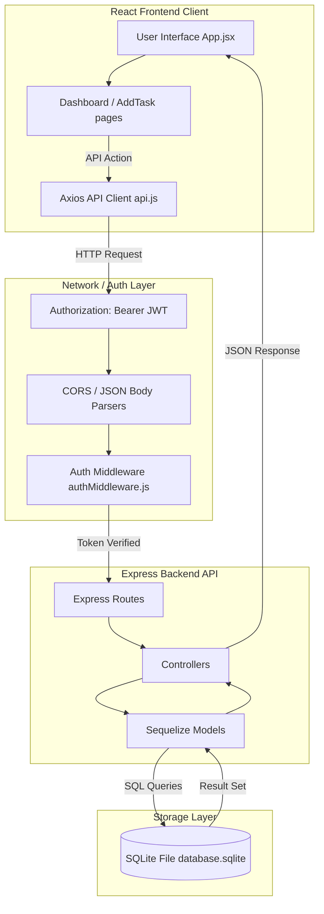

# 📘 TaskFlow Project Documentation & System Architecture Guide

This document provides a comprehensive overview of the architecture, tech stack selection, data flow pathways, running guidelines, and future enhancement paths for the **TaskFlow Mini Project Management Portal**.

---

## 1. 🛠️ Tech Stack Selection & Rationale

| Layer | Technology | Rationale |
| :--- | :--- | :--- |
| **Frontend Core** | React (Vite-based) | High-performance single-page app rendering. Vite provides near-instant Hot Module Replacement (HMR) and highly optimized asset bundling. |
| **Frontend Styling**| Vanilla CSS | Custom, responsive stylesheet without bulky framework dependencies. Ensures maximum styling control, lightweight CSS sizes, and high-performance transitions. |
| **API Client** | Axios | Simplifies promise-based HTTP queries, offers auto-JSON transformation, and supports interceptors for global authentication state management. |
| **Backend Framework**| Node.js & Express | Asynchronous event loop design suitable for high-throughput REST APIs. Extremely modular with extensive library ecosystems. |
| **ORM Layer** | Sequelize | A promise-based Node.js ORM. Abstracting database queries via Sequelize makes switching between SQLite, MySQL, and PostgreSQL simple. |
| **Database** | SQLite | File-based SQL database storing entries in `database.sqlite`. Eliminates the need to install or run external database servers, running immediately out-of-the-box. |
| **Authentication** | JWT (JSON Web Tokens) | Stateless sessions. The server signs a token mapping the user's ID; the client sends this token in authorization headers. |
| **Security** | bcryptjs | Safe cryptographic password hashing using salt blocks to protect user records. |
| **Testing** | Jest & Supertest | Robust assertions and high-speed integration testing of REST endpoints without starting live network ports. |

---

## 2. 🏗️ System Architecture & Data Flow

TaskFlow follows a standard decoupled **Client-Server Relational Architecture**:



### 🔁 Request-Response Cycle Flow
1. **User Action**: A user logs in, creates a task, or filters tasks on the frontend.
2. **Axios Dispatch**: The frontend triggers an Axios query. The interceptor fetches the JWT token from `localStorage` and appends it to the header: `Authorization: Bearer <token>`.
3. **API Routing**: Express receives the query. The global CORS middleware accepts the origin, and JSON parser decodes the request body.
4. **Auth Guard**: The task router intercepts the call with `protect` middleware. The token is parsed using `jsonwebtoken.verify()`. If valid, it queries the User database, appends the user model to `req.user`, and calls `next()`.
5. **Business Logic Execution**: The controller handles validations (e.g. title presence, description character limit) and performs SQL queries scoped strictly to `req.user.id` using Sequelize.
6. **Data Output**: The controller returns a structured JSON package (containing page data, count summaries, or success messages) which the React page renders dynamically.

---

## 3. ⚙️ How to Run the Project

### System Pre-requisites
- **Node.js**: Version 16.x or higher
- **npm**: Version 8.x or higher

### Step-by-Step Execution Guide

#### Step 1: Clone and Enter Root
Open your shell terminal:
```bash
git clone <repository-url>
cd Project_Mngmnt_o2h
```

#### Step 2: Launch the Backend Server
1. Navigate to the backend folder:
   ```bash
   cd backend
   ```
2. Install package dependencies:
   ```bash
   npm install
   ```
3. Start the dev server:
   ```bash
   npm run dev
   ```
   *The backend will boot up at `http://localhost:5000` and automatically create the SQLite database file `database.sqlite` inside the backend root folder.*

#### Step 3: Launch the Frontend App
1. Open a new terminal tab/window and enter the frontend folder:
   ```bash
   cd ../frontend
   ```
2. Install package dependencies:
   ```bash
   npm install
   ```
3. Start Vite dev server:
   ```bash
   npm run dev
   ```
   *The web interface will start at `http://localhost:5173/`.*
4. Open your browser and go to `http://localhost:5173/`.

#### Step 4: Run Automated API Tests
To run the automated tests verify routing, validation rules, and authentication locks:
```bash
cd ../backend
npm test
```

---

## 4. 🚀 Future Enhancements & Scalability Plan

To transition this application from a prototype to a production-grade enterprise platform, the following enhancements are recommended:

### 1. Architectural Upgrades
- **TypeScript Migration**: Convert both frontend and backend to TypeScript. This enforces compile-time type checking, minimizing runtime reference errors.
- **Global State Management**: Transition local React states to **Redux Toolkit** or **Zustand**. This helps manage user login, settings, caching, and task data in a centralized store.
- **Production Relational DB**: Transition Sequelize from SQLite to a dedicated **MySQL** or **PostgreSQL** instance in production by changing environment variables.

### 2. Feature Additions
- **User Roles & Permissions (RBAC)**: Add Roles (e.g. `Admin`, `Project Manager`, `Developer`). Managers can assign tasks, Developers can only update statuses, and Admins manage users.
- **Task Comments & File Attachments**: Enable team members to post comments and upload documentation or images directly to a task card.
- **Drag-and-Drop Kanban Board**: Replace/augment the grid layout with a Kanban board (using `react-beautiful-dnd` or `@dnd-kit`) to let users drag tasks between `Pending`, `In Progress`, and `Completed` columns.
- **Real-time Collaboration**: Integrate **Socket.io** (WebSockets) to broadcast updates in real time. If team member A completes a task, the statistics and task cards update instantly on team member B's dashboard.
- **Activity Log & Audit Trail**: Track every task action (e.g., `"John Doe updated status to In Progress on June 20 at 16:30"`) to log project changes.
- **Task Reminders & Email Alerts**: Integrate node-cron on the backend and Nodemailer to send automated email alerts for upcoming deadlines.

### 3. Devops & Quality Assurance
- **Dockerization**: Create `Dockerfile` and `docker-compose.yml` configs to containerize frontend, backend, and database dependencies, ensuring clean setups across dev machines.
- **CI/CD Integration**: Add GitHub Actions to run Jest tests, build the Vite bundles, and execute lint rule checks on every git push or pull request.
